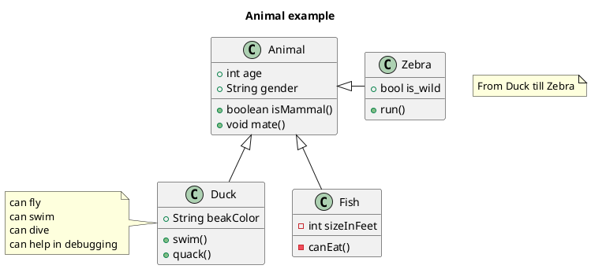
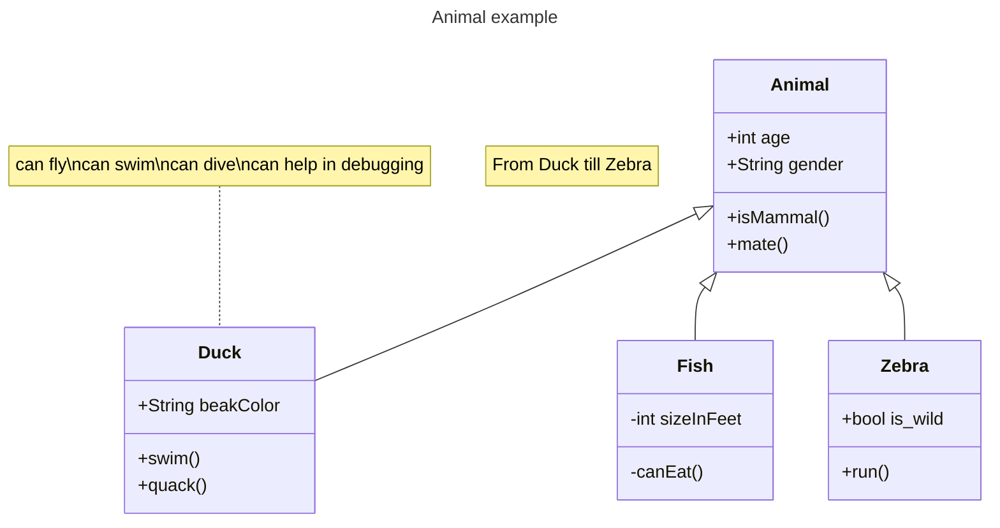

# seminario-1

## Markdown

- item
- item
- item

1. valor
2. valor
3. valor

| title1 | title2 |
| ------ | ------ |
| a      | b      |

[Markdown](https://docs.github.com/pt/get-started/writing-on-github/getting-started-with-writing-and-formatting-on-github/basic-writing-and-formatting-syntax)

## Plantuml

[PlantUML Class Diagram](https://plantuml.com/class-diagram)

## Mermaid

[Mermaid Class Diagram](https://mermaid.js.org/syntax/classDiagram.html)

## Markdown Preview Enhanced

[Markdown Preview Enhanced](https://shd101wyy.github.io/markdown-preview-enhanced/#/)

@import "src/Classe.java"